# FlowOrchestrator

> **Production-grade Kafka-based async workflow orchestration engine built in Go.**
> Demonstrates the distributed systems patterns that appear in every senior backend interview.

Built to demonstrate real-world distributed systems concepts including workflow orchestration, retries, idempotency, DLQs, observability, and fault tolerance.

---

## Demo

### Live System Dashboard

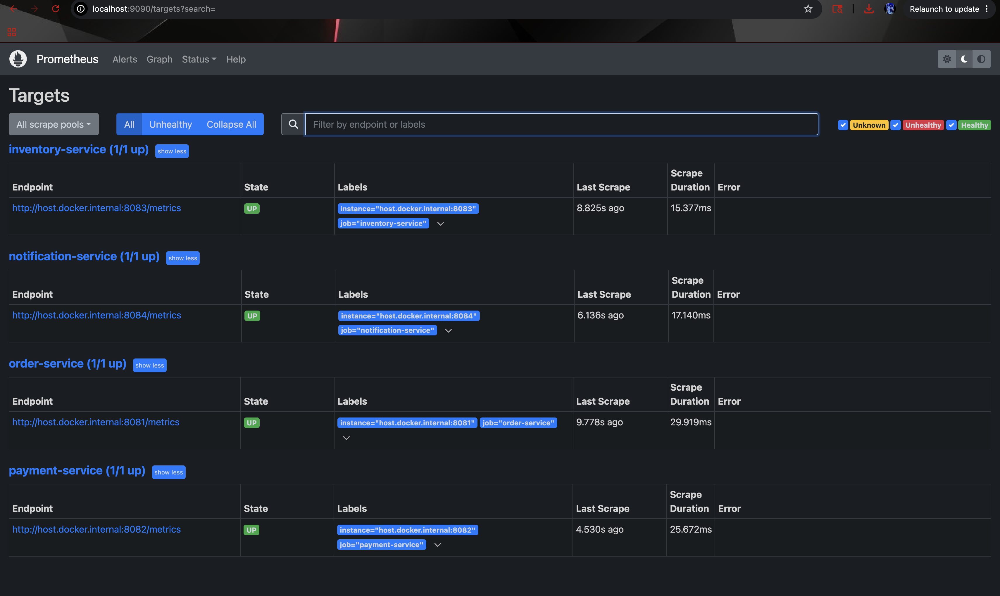

_Tip: fire `curl -X POST http://localhost:8082/config/payment-failure-rate -d '{"rate":0}'` first, then POST an order. All 4 services process the event within ~300ms._

---

### Retry + DLQ Flow

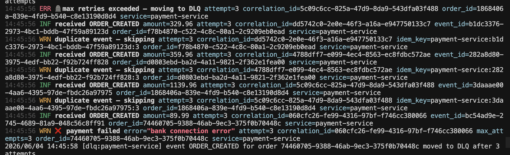

```
11:42:12 WRN ❌ payment failed  error="insufficient funds"  attempt=0
11:42:13 INF 🔄 retry scheduled retry_in=1.04s             next_attempt=1
11:42:17 WRN ❌ payment failed  error="card declined"       attempt=1
11:42:17 INF 🔄 retry scheduled retry_in=2.11s             next_attempt=2
11:42:20 WRN ❌ payment failed  error="gateway timeout"     attempt=2
11:42:20 ERR 🪦 max retries exceeded — moving to DLQ
```

> Payment failures trigger exponential-backoff retries.
> After 3 failed attempts the event is moved to the DLQ.
> Idempotency prevents duplicate charges during retries.

---

## What This Project Demonstrates

| Pattern | Implementation |
|---|---|
| **Event-driven architecture** | 4 fully decoupled services communicating only via Kafka |
| **Kafka consumer groups** | Each service has its own group ID — every message delivered to all interested services |
| **Workflow state machine** | Validated transitions enforced in DB with `FOR UPDATE` row lock |
| **Exponential backoff retries** | `min(base × 2^attempt, 30s) ± 10% jitter` persisted in PostgreSQL |
| **Dead Letter Queues** | After max retries: DB record + Kafka `dlq.events` topic for alerting |
| **Idempotent consumers** | `INSERT ON CONFLICT DO NOTHING` — single atomic operation, no SELECT+INSERT race |
| **Distributed tracing** | `correlation_id` propagated through every event, log line, and DB row |
| **PostgreSQL advisory locking** | `FOR UPDATE SKIP LOCKED` lets N replicas poll retry queue without conflict |
| **Prometheus observability** | Counters, histograms, and gauges for every service and event type |
| **Structured logging** | `zerolog` — every log carries service, correlation_id, order_id, attempt |
| **Live failure simulation** | `POST /config/payment-failure-rate` — change failure rate without restart |

---

## Architecture

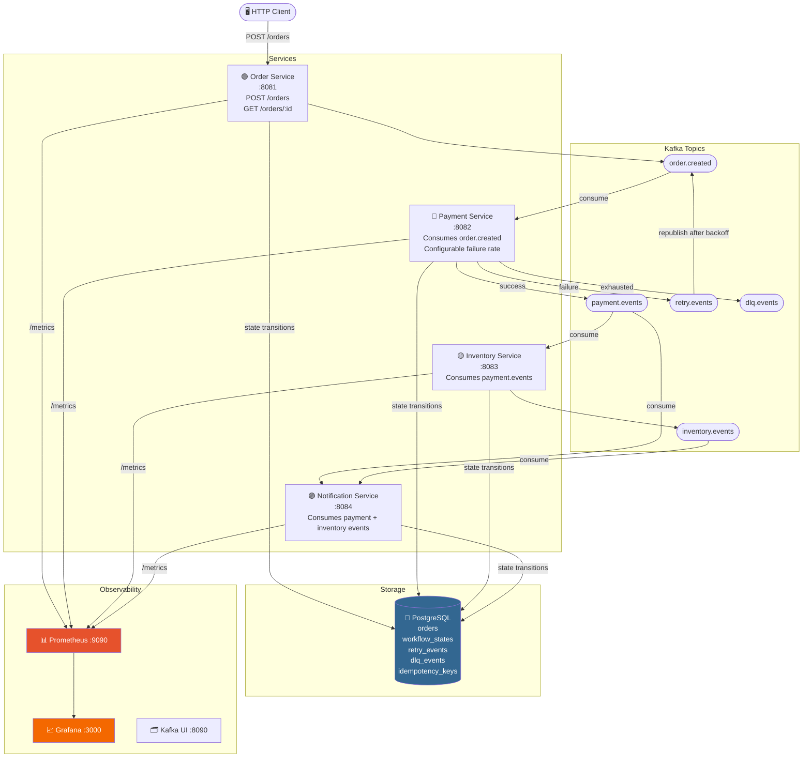

---

## Workflow State Machine

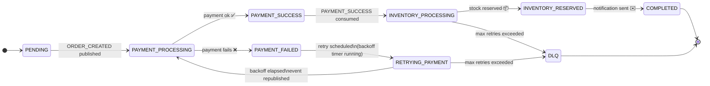

**Key design insight:** `RETRYING_PAYMENT` makes the backoff window **observable**.
An order in this state means: *"payment failed, retry is scheduled at X time."*
Previously `PAYMENT_FAILED` was ambiguous — did it mean "terminal" or "waiting to retry"?

---

## Sequence Diagrams

### Happy Path

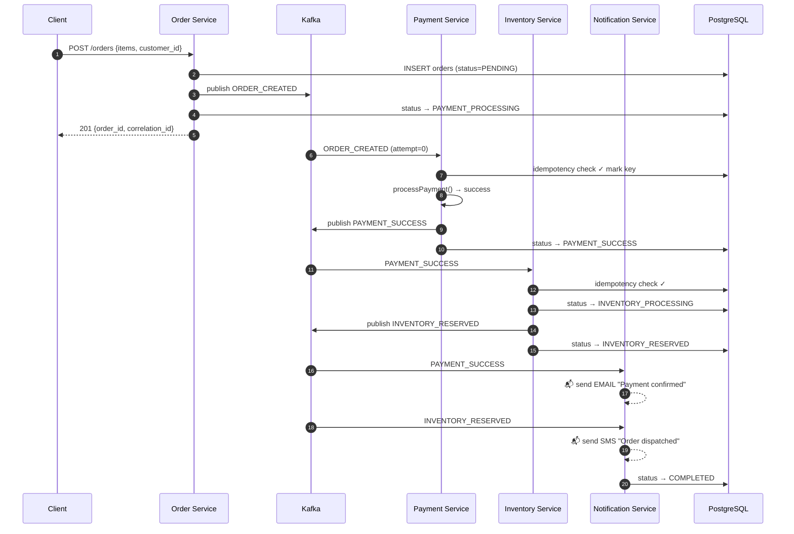

### Retry + DLQ Path

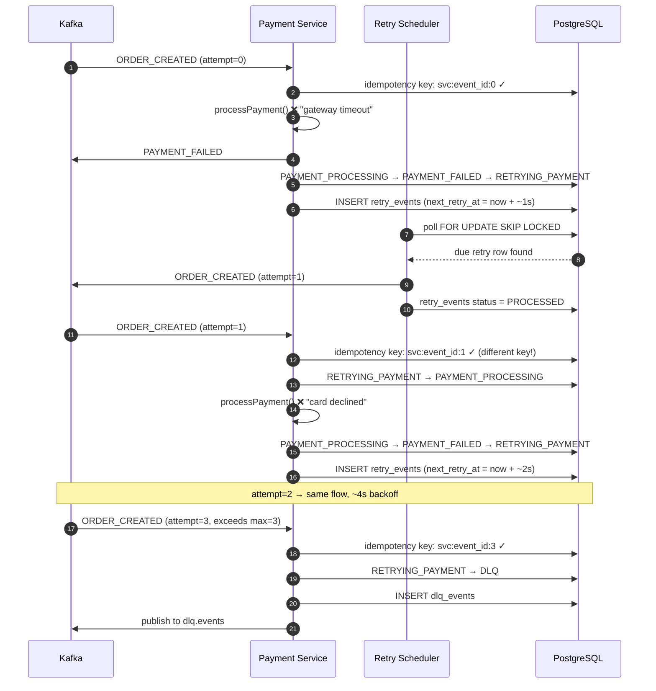

---

## Retry Architecture

```
Event fails
    │
    ├── attempt < 3 ──▶ INSERT retry_events (next_retry_at = now + backoff)
    │                   Retry scheduler polls every 5s:
    │                     SELECT ... FOR UPDATE SKIP LOCKED LIMIT 20
    │                   Republish to original topic with attempt_count++
    │
    └── attempt ≥ 3 ──▶ INSERT dlq_events
                        Publish to dlq.events Kafka topic
                        State → DLQ

Backoff: min(1s × 2^attempt, 30s) ± 10% jitter (thundering herd prevention)

  Attempt 0 fails → retry in ~1s
  Attempt 1 fails → retry in ~2s
  Attempt 2 fails → retry in ~4s → DLQ
```

---

## Observability

### Prometheus Metrics

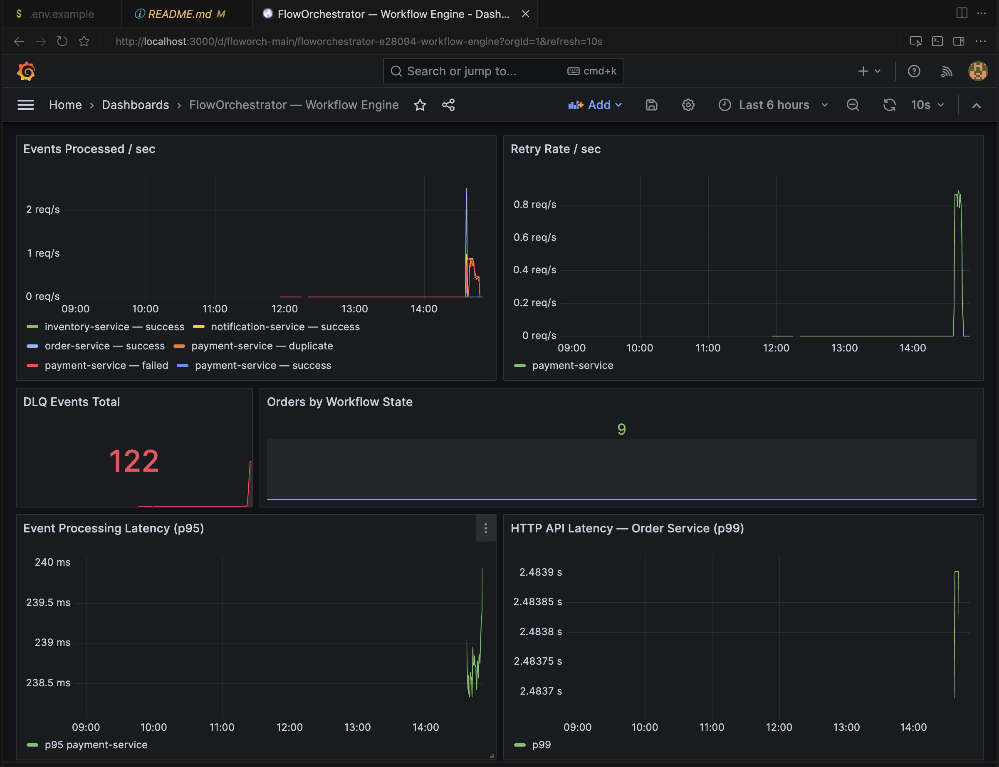

_Open http://localhost:3000 (admin/admin) → Dashboards → FlowOrchestrator_

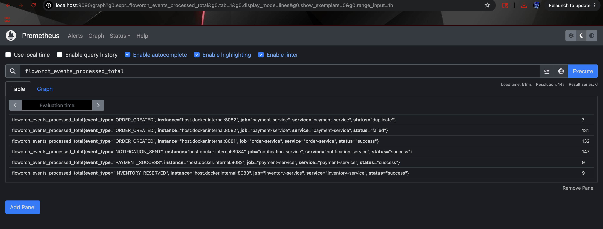

_Raw metrics at http://localhost:9090 — useful for ad-hoc PromQL queries_

| Metric | Type | Labels |
|---|---|---|
| `floworch_events_processed_total` | Counter | service, event_type, status |
| `floworch_event_duration_seconds` | Histogram | service, event_type |
| `floworch_retry_scheduled_total` | Counter | service, event_type, attempt |
| `floworch_dlq_total` | Counter | service, event_type |
| `floworch_workflow_state_orders` | Gauge | state |
| `floworch_http_request_duration_seconds` | Histogram | method, path, status |

Useful queries:
```promql
# Retry rate per service
sum by (service) (rate(floworch_retry_scheduled_total[1m]))

# p95 processing latency
histogram_quantile(0.95, sum by (service,le) (rate(floworch_event_duration_seconds_bucket[5m])))

# DLQ events in last hour
increase(floworch_dlq_total[1h])
```

---

## Kafka Topics

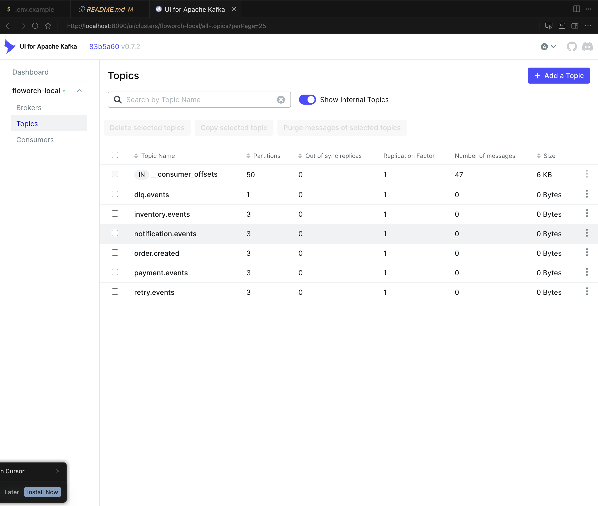

_Open http://localhost:8090 → Topics to see live message flow_

| Topic | Partitions | Producer | Consumer(s) | Partition Key |
|---|---|---|---|---|
| `order.created` | 3 | Order Service | Payment Service | `order_id` |
| `payment.events` | 3 | Payment Service | Inventory, Notification | `order_id` |
| `inventory.events` | 3 | Inventory Service | Notification | `order_id` |
| `notification.events` | 3 | Notification Service | — (audit) | `order_id` |
| `retry.events` | 3 | Any service | Retry Scheduler | `order_id` |
| `dlq.events` | 1 | Retry Scheduler | Alerting | `order_id` |

**Why partition by `order_id`?** All events for a single order land on the same partition — preserving ordering within one order's lifecycle even under concurrent load.

---

## Database Schema

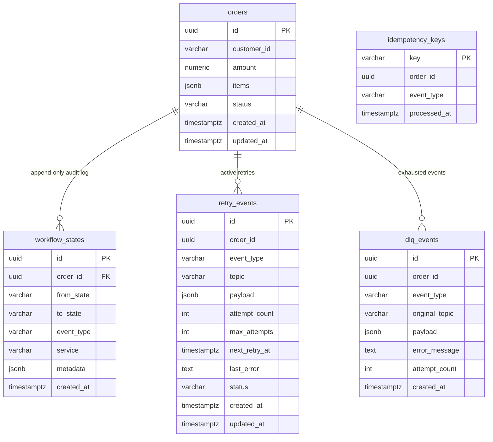

---

## Interesting Engineering Decisions

### Why `FOR UPDATE SKIP LOCKED` for the retry scheduler?

The naïve approach — `SELECT * FROM retry_events WHERE status='PENDING' AND next_retry_at <= NOW()` — has a race condition: two instances of the payment service both pick up the same row, both republish the same event, and you get double-processing.

`FOR UPDATE SKIP LOCKED` solves this atomically at the DB level. When instance A locks row R, instance B's query simply skips it and moves to the next due row. No coordination, no distributed lock, no Redis needed. The lock is held only for the duration of the publish + UPDATE — microseconds.

This also means you get **free horizontal scaling** of the retry scheduler: run 5 replicas, they divide the work automatically.

---

### Why PostgreSQL for retries instead of Kafka delay topics?

**Kafka delay topics** (the alternative): you'd create topics like `retry.1s`, `retry.2s`, `retry.4s`, consume from each with appropriate delays. Simpler operationally — no extra DB table, no scheduler loop.

**Why PostgreSQL instead:**
1. `next_retry_at` is a timestamp — you can see *exactly* when each order will be retried. With delay topics, that's opaque.
2. You can manually update `next_retry_at` to retry an order immediately without touching Kafka.
3. `retry_events` gives you a query interface: "how many orders are waiting to retry right now, and what's their average wait time?"
4. The DLQ table is self-contained — one `SELECT * FROM dlq_events` shows every failed order.

The tradeoff: the retry scheduler is an extra moving part that needs to run. In a Kubernetes deployment, it runs as a sidecar in each service pod.

---

### Why `ON CONFLICT DO NOTHING` for idempotency instead of SELECT then INSERT?

The two-step approach:
```sql
-- Step 1
SELECT COUNT(*) FROM idempotency_keys WHERE key = $1
-- Step 2 (if 0)
INSERT INTO idempotency_keys ...
```

Has a classic TOCTOU race: two concurrent consumers both run step 1, both get 0, both proceed to step 2 — double-processing.

The single-statement approach:
```sql
INSERT INTO idempotency_keys (...) VALUES (...) ON CONFLICT (key) DO NOTHING
```

Is atomic. The database serialises concurrent inserts on the same key at the constraint level. `RowsAffected() == 0` means someone else already processed it. One statement, no race, no transaction needed.

---

### Why serializable isolation for workflow state transitions?

The workflow engine uses `sql.LevelSerializable` + `FOR UPDATE`:
```sql
BEGIN ISOLATION LEVEL SERIALIZABLE;
SELECT status FROM orders WHERE id = $1 FOR UPDATE;  -- locks the row
-- validate transition
UPDATE orders SET status = $2 ...
INSERT INTO workflow_states ...
COMMIT;
```

Without `FOR UPDATE`, two services could both read `PAYMENT_PROCESSING`, both validate that `→ PAYMENT_SUCCESS` is valid, and both write — creating duplicate `workflow_states` entries and potentially double-paying.

`FOR UPDATE` makes this a critical section: the second service blocks until the first commits, then reads the updated state (`PAYMENT_SUCCESS`) and correctly finds no valid transition.

---

### Why is `RETRYING_PAYMENT` a separate state from `PAYMENT_FAILED`?

Original design had `PAYMENT_FAILED` overloaded:
- Meaning 1: "payment attempt failed, retry is scheduled" (transient)
- Meaning 2: "all retries exhausted, this order is dead" (terminal)

You couldn't tell from the state alone whether an order would be retried.

With `RETRYING_PAYMENT`:
```sql
-- "How many orders are currently in backoff?"
SELECT COUNT(*) FROM orders WHERE status = 'RETRYING_PAYMENT';

-- "Which orders failed permanently?"
SELECT * FROM orders WHERE status = 'DLQ';

-- "What's the next retry time for this order?"
SELECT next_retry_at FROM retry_events
WHERE order_id = $1 AND status = 'PENDING';
```

Each state has exactly one meaning. The audit trail in `workflow_states` shows every hop including the `RETRYING_PAYMENT` windows.

---

### Why append-only `workflow_states` instead of a single status column?

The `orders.status` column is the current state — fast to read, indexed.
The `workflow_states` table is the audit log — every transition is a new `INSERT`, never updated.

Benefits:
1. **Full history** — you can reconstruct the exact timeline of any order
2. **Debuggability** — `SELECT * FROM workflow_states WHERE order_id = X ORDER BY created_at` shows the entire journey
3. **Analytics** — "how long do orders spend in RETRYING_PAYMENT on average?"
4. **No data loss** — even if you transition A→B→C, the A→B entry is permanent

The tradeoff: slightly more storage. Rows are tiny (5 varchars + timestamp) and the table is write-once, so it compresses extremely well.

---

## Failure Simulation API

Control the payment failure rate **live** without restarting anything:

```bash
# Force 100% failure — watch retries then DLQ fill up
curl -X POST http://localhost:8082/config/payment-failure-rate \
     -H "Content-Type: application/json" \
     -d '{"rate": 100}'

# Recover — new orders succeed, DLQ orders stay stuck (already exhausted)
curl -X POST http://localhost:8082/config/payment-failure-rate \
     -d '{"rate": 0}'

# Realistic 30% failure
curl -X POST http://localhost:8082/config/payment-failure-rate \
     -d '{"rate": 30}'

# Check current rate
curl http://localhost:8082/config/payment-failure-rate
```

---

## Running Locally

### Prerequisites
- Go 1.22+
- Docker Desktop

### 1. Start infrastructure

```bash
make up
# Kafka UI  → http://localhost:8090
# Prometheus → http://localhost:9090
# Grafana   → http://localhost:3000  (admin/admin)
```

### 2. Run migrations (if using local PostgreSQL)

Open DBeaver → `floworch` database → SQL Editor, run all files in `migrations/` in order.

### 3. Start all services

```bash
# 4 separate terminals
go run ./cmd/order-service/...
go run ./cmd/payment-service/...
go run ./cmd/inventory-service/...
go run ./cmd/notification-service/...
```

### 4. Fire an order

```bash
curl -s -X POST http://localhost:8081/orders \
  -H "Content-Type: application/json" \
  -d '{
    "customer_id": "cust-001",
    "items": [
      {"product_id": "p1", "name": "Laptop", "quantity": 1, "price": 999.99},
      {"product_id": "p2", "name": "Mouse",  "quantity": 2, "price":  29.99}
    ]
  }' | jq .
```

### 5. Track the order

```bash
# Full state history
curl -s http://localhost:8081/orders/<order_id> | jq .history
```

```sql
-- Live view in DBeaver
SELECT from_state, to_state, event_type, service, created_at
FROM workflow_states
WHERE order_id = '<order_id>'
ORDER BY created_at;
```

---

## Load Testing

```bash
# 100 orders, 10 concurrent workers (default)
go run ./cmd/loadtest/...

# 500 orders, 50 workers
go run ./cmd/loadtest/... -n 500 -c 50

# With failure rate 100% — watch retry/DLQ at scale
curl -X POST http://localhost:8082/config/payment-failure-rate -d '{"rate":100}'
go run ./cmd/loadtest/... -n 50 -c 10
```

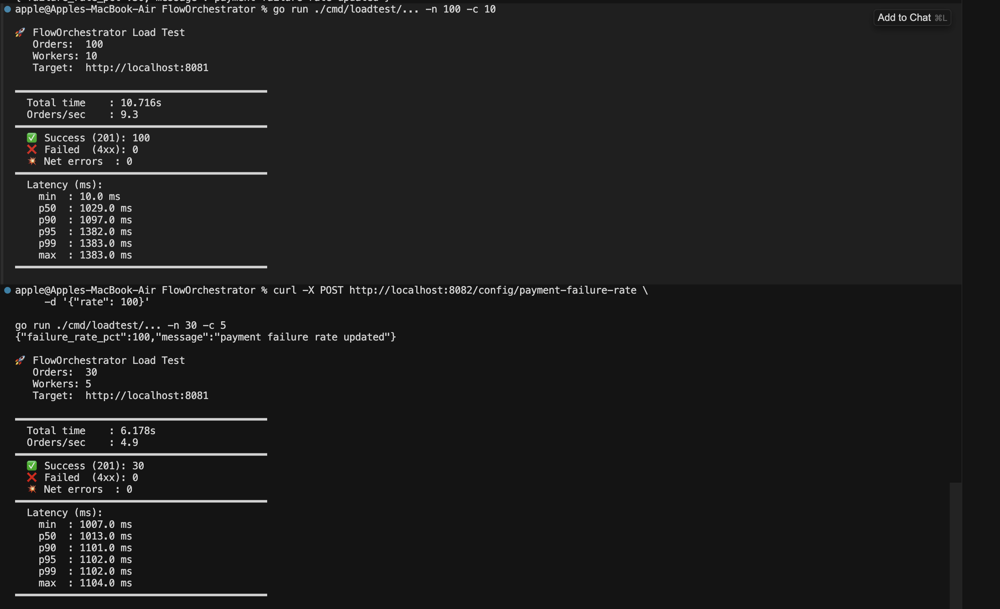

Sample output (failure rate 0%):
```
🚀 FlowOrchestrator Load Test
   Orders:  100  |  Workers: 10  |  Target: http://localhost:8081

━━━━━━━━━━━━━━━━━━━━━━━━━━━━━━━━━━━━━━━━━━━
  Total time    : 1.24s       Orders/sec: 80.6
━━━━━━━━━━━━━━━━━━━━━━━━━━━━━━━━━━━━━━━━━━━
  ✅ Success (201): 100
  ❌ Failed  (4xx): 0
━━━━━━━━━━━━━━━━━━━━━━━━━━━━━━━━━━━━━━━━━━━
  Latency  min: 8ms  p50: 12ms  p95: 22ms  p99: 31ms  max: 45ms
━━━━━━━━━━━━━━━━━━━━━━━━━━━━━━━━━━━━━━━━━━━
```

---

## Trade-offs

| Decision | Choice | Alternative | Why |
|---|---|---|---|
| Retry storage | PostgreSQL | Kafka delay topics | Observable (`next_retry_at`), queryable, manually overridable |
| Idempotency | `INSERT ON CONFLICT` | Redis SET NX | No extra dependency; atomic at DB level |
| State locking | `FOR UPDATE` | Optimistic locking | Simpler; contention is rare (one order per lock) |
| Retry scheduler | Polling (5s) | Cron / scheduled tasks | Keeps scheduler co-located with service; simpler ops |
| Schema evolution | `version: "v1"` in events | Confluent Schema Registry | Simpler for a demo; Schema Registry for production |
| Tracing | Correlation ID in logs | OpenTelemetry + Jaeger | Grep-friendly; OTel would add spans across services |
| Service discovery | None (local ports) | Kubernetes DNS / Consul | Out of scope for the demo |

---

## Future Improvements

- [ ] **OpenTelemetry** — distributed traces with Jaeger instead of manual correlation IDs
- [ ] **Grafana alerts** — alert when DLQ count > 0 or retry rate spikes
- [ ] **Schema Registry** — Confluent Schema Registry for Avro/Protobuf event schemas
- [ ] **Kafka Streams** — replace the retry scheduler with a Kafka Streams topology
- [ ] **gRPC** — replace HTTP between services with gRPC for type-safe contracts
- [ ] **Auth** — JWT middleware on the Order Service API
- [ ] **Order reconciler** — background job to re-publish orders stuck in PAYMENT_PROCESSING > N minutes (handles Kafka producer crash before publish)

---

## Project Structure

```
FlowOrchestrator/
├── cmd/
│   ├── order-service/         # HTTP API — POST /orders, GET /orders/:id
│   ├── payment-service/       # Kafka consumer + retry + DLQ + failure config API
│   ├── inventory-service/     # Kafka consumer — stock reservation
│   ├── notification-service/  # Kafka consumer — email/SMS simulation
│   └── loadtest/              # Concurrent load test with latency percentiles
├── internal/
│   ├── kafka/                 # Generic producer + consumer wrappers
│   ├── workflow/              # State machine + engine (validated transitions)
│   ├── retry/                 # Policy, backoff calculator, DB scheduler
│   ├── idempotency/           # Atomic check-and-mark store
│   ├── logger/                # zerolog with correlation ID propagation
│   ├── observability/         # Prometheus metric definitions
│   └── db/                    # PostgreSQL connection pool
├── pkg/events/                # Shared event contracts (BaseEvent, OrderCreated, …)
├── migrations/                # SQL schema — 001 orders … 005 dlq_events
├── grafana/                   # Auto-provisioned dashboard + datasource
├── docs/images/               # Screenshots and GIFs (add after running locally)
├── docker-compose.yml         # Kafka, Postgres, Prometheus, Grafana, Kafka UI
├── prometheus.yml             # Scrape config
└── Makefile
```
